# Pensive System Architecture

```mermaid
graph TB
    %% User Interfaces
    User[👤 User]
    Browser[🌐 Browser]
    Mobile[📱 Mobile/Telegram]
    
    %% Client-side Components
    BrowserExt[🔌 Browser Extension<br/>Chrome/Firefox]
    TelegramBot[🤖 Telegram Bot]
    WebApp[💻 Web Application<br/>Go Templates + HTMX]
    
    %% Authentication Services
    OAuth[🔐 OAuth Providers<br/>GitHub/Google]
    MagicLink[✉️ Magic Link System]
    Traditional[🔑 Email/Password Auth]
    
    %% Core Backend
    GoBackend[⚙️ Go Backend Server<br/>Chi Router + Services]
    ImportProcessor[📥 Background Import Processor<br/>Pocket Migration]
    
    %% Data & External Services
    PostgreSQL[(🗄️ PostgreSQL Database<br/>Full-text Search + Sessions)]
    Gemini[🧠 Google Gemini API<br/>AI Summarization]
    Stripe[💳 Stripe API<br/>Premium Subscriptions]
    
    %% User Flow Connections
    User --> Browser
    User --> Mobile
    Browser --> BrowserExt
    Browser --> WebApp
    Mobile --> TelegramBot
    
    %% Authentication Flow
    WebApp --> OAuth
    WebApp --> MagicLink
    WebApp --> Traditional
    
    %% Backend Service Connections
    BrowserExt --> GoBackend
    TelegramBot --> GoBackend
    WebApp --> GoBackend
    
    %% Background Processing
    GoBackend --> ImportProcessor
    ImportProcessor --> PostgreSQL
    
    %% External API Connections
    GoBackend --> Gemini
    GoBackend --> Stripe
    GoBackend --> PostgreSQL
    
    %% Styling
    classDef userInterface fill:#e1f5fe,stroke:#01579b,stroke-width:2px
    classDef backend fill:#f3e5f5,stroke:#4a148c,stroke-width:2px
    classDef database fill:#e8f5e8,stroke:#1b5e20,stroke-width:2px
    classDef external fill:#fff3e0,stroke:#e65100,stroke-width:2px
    
    class User,Browser,Mobile,BrowserExt,TelegramBot,WebApp userInterface
    class GoBackend,ImportProcessor backend
    class PostgreSQL database
    class OAuth,MagicLink,Traditional,Gemini,Stripe external
```

## Key Architecture Highlights

### Multi-Platform Content Ingestion
- **Browser Extensions**: One-click bookmark saving with automatic content extraction
- **Telegram Bot**: Mobile-friendly sharing from any app
- **Web Interface**: Direct bookmark management and search
- **Unified Pipeline**: All inputs processed through consistent backend services

### Complete Authentication Ecosystem  
- **OAuth Integration**: GitHub/Google for frictionless signup
- **Magic Links**: Passwordless authentication reducing friction
- **Traditional Auth**: Email/password with verification workflows
- **API Tokens**: Secure programmatic access for extensions

### Background Processing System
- **Import Processor**: Handles Pocket migration with thousands of bookmarks
- **Asynchronous Jobs**: PostgreSQL-based job queue with status tracking
- **AI Enhancement**: Background processing of summaries and tags
- **Progress Monitoring**: Real-time status updates via database polling

### Data Architecture
- **PostgreSQL Full-Text Search**: Native search with tsvector indexing
- **Session Management**: Secure user sessions with CSRF protection  
- **Premium Integration**: Stripe subscription management with webhooks
- **Content Storage**: Structured bookmark data with metadata preservation